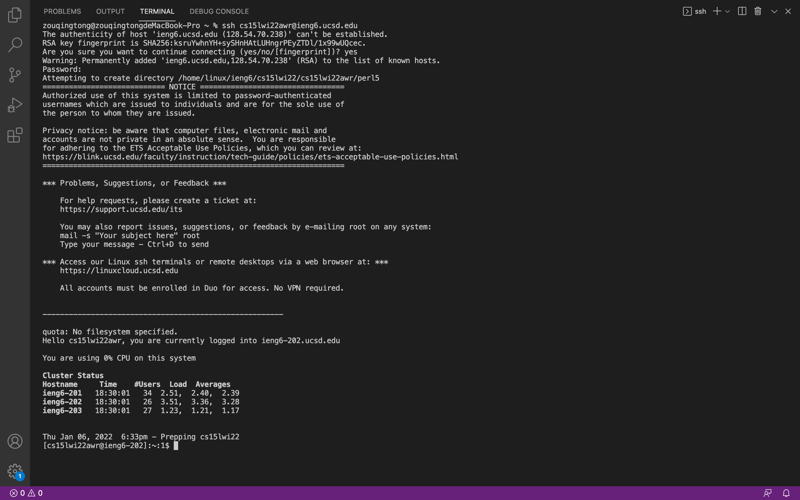

# Lab Report 1
## Installing VSCode
* Go to the Visual Studio Code website [Link](https://code.visualstudio.com/).
* Install the corresponding version to the operating system on your device, such as OSX and Windows.

## Remotely Connecting
* Open a terminal in VSCode.
* Type `ssh cs15lwi22zz@ieng6.ucsd.edu` in the command, with “zz” replaced by the letters in your course-specific account.
* Type yes and press enter.
* Type your password (it’s normal if the password is not displayed).

## Trying Some Commands
* Try running the commands `cd`, `ls`, `pwd`, `mkdir`, and `cp` on the remote computer.
* Log out of the remote server in your terminal by using Ctrl-D or running the command `exit`.
* Try running the commands `cd`, `ls`, `pwd`, `mkdir`, and `cp` on your computer.

## Moving Files with `scp`
* Create a file on your computer called WhereAmI.java.
* Put the following codes into it:
```
class WhereAmI {
    public static void main(String[] args) {
        System.out.println(System.getProperty("os.name"));
        System.out.println(System.getProperty("user.name"));
        System.out.println(System.getProperty("user.home"));
        System.out.println(System.getProperty("user.dir"));
    }
}
```
* Use `javac` and `java` commands to run the code.
* Use the code `scp WhereAmI.java cs15lwi22zz@ieng6.ucsd.edu:~/` to copy the file from your computer to the server (remember to run the code in the terminal from the same directory that you created WhereAmI.java and to use your own username).
* Type your password if you are prompted for it.
* Log into the remote computer with the same `ssh` code.
* Use `ls` command and see if the file is in the home directory (it should be).
* Run the file using `javac` and `java` on the remote computer.

## Setting an SSH Key
* Use `ssh-keygen` to create two files, a private key and a public key, in the .ssh directory on your computer.
* Use `/Users/username/.ssh/id_rsa` to save the private key in file id_rsa (use your own username).
* Press enter when you are prompted for passphrase
* Log into the remote computer with `ssh`.
* Type `mkdir .ssh` in the terminal.
* Logout
* Use `scp /Users/username/.ssh/id_rsa.pub cs15lwi22zz@ieng6.ucsd.edu:~/.ssh/authorized_keys` to copy the public key to the .ssh directory on the server (use your username and account).
* You can now `ssh` or `scp` from your computer to the remote computer without password.

## Optimizing Remote Running
-Add the code `System.out.println("Hello!");` to WhereAmI.java and save it.
-Use `scp` to copy the file from your computer to the remote computer.
-Use `ssh cs15lwi22@ieng6.ucsd.edu "ls"` to log in and list the home directory on the remote server in one line.
-Use `cp WhereAmI.java OtherMain.java; javac OtherMain.java; java WhereAmI` to run the file in one line.
