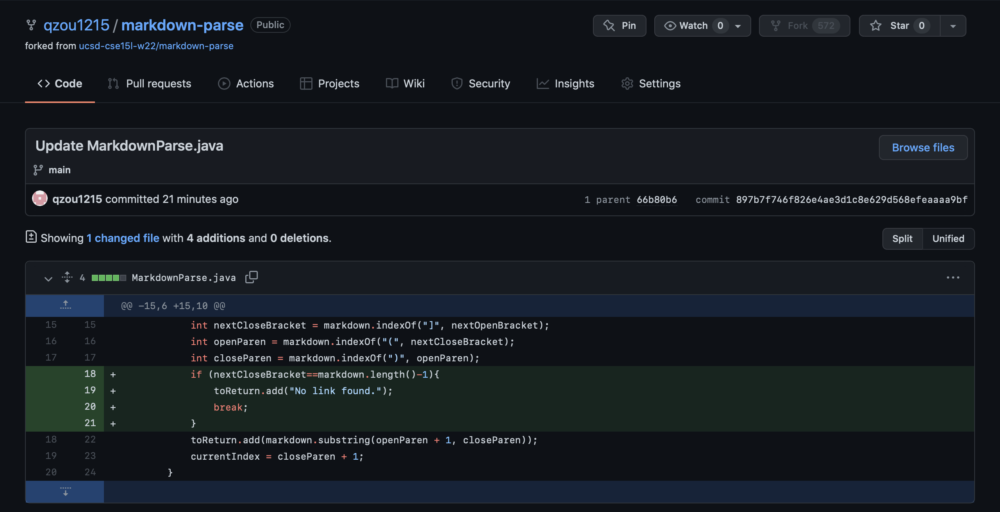
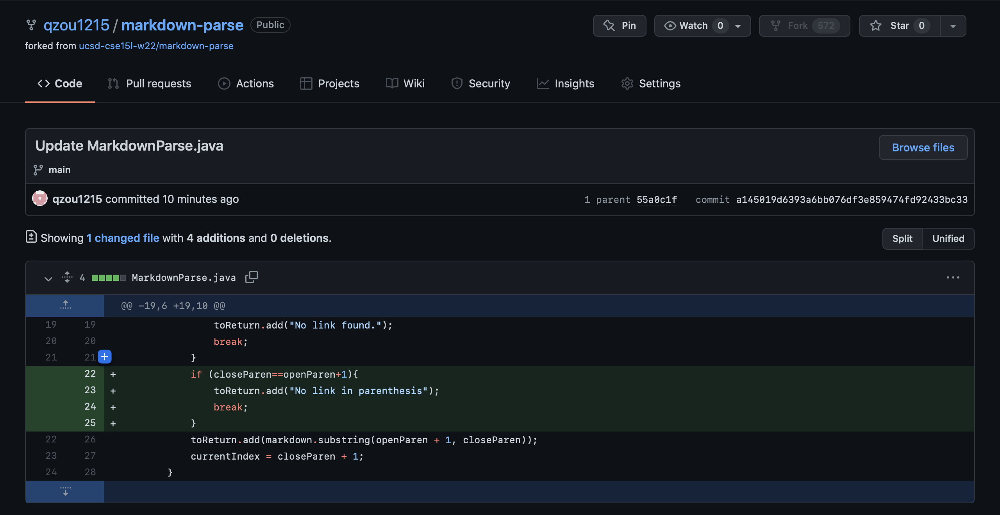

# Lab Report 2
## Code Change 1
* Code change

* Test file for a failure-inducing input ([link](https://github.com/qzou1215/markdown-parse/blob/25a2c4e252ef1124775cfbaaf597681f0f5e2acd/test-file9.md))
* Symptom of the failure-inducing input
```
zouqingtong@zouqingtongdeMacBook-Pro Untitled % javac MarkdownParse.java
zouqingtong@zouqingtongdeMacBook-Pro Untitled % java MarkdownParse test-file9.md
Exception in thread "main" java.lang.StringIndexOutOfBoundsException: begin 0, end -1, length 8
        at java.base/java.lang.String.checkBoundsBeginEnd(String.java:4601)
        at java.base/java.lang.String.substring(String.java:2704)
        at MarkdownParse.getLinks(MarkdownParse.java:18)
        at MarkdownParse.main(MarkdownParse.java:26)
```
* The input does not contain open or closed parenthesis, so both `openParen` and `closeParen` will be -1. This causes a bug because the `substring` method will have arguments `0` and `-1`, which causes an `IndexOutOfBoundsException` error in the output.
## Code Change 2
* Code change

* Test file for a failure-inducing input ([link](https://github.com/qzou1215/markdown-parse/blob/25a2c4e252ef1124775cfbaaf597681f0f5e2acd/test-file10.md))
* Symptom of the failure-inducing input
```
zouqingtong@zouqingtongdeMacBook-Pro Untitled % javac MarkdownParse.java
zouqingtong@zouqingtongdeMacBook-Pro Untitled % java MarkdownParse test-file10.md
[]
```
* The input does not contain any content in the parenthesis, so `substring` method would return an empty string. This would make `toReturn` an empty arraylist, which is an unexpected output.
## Code Change 3
* Code change

* Test file for a failure-inducing input ([link](https://github.com/qzou1215/markdown-parse/blob/25a2c4e252ef1124775cfbaaf597681f0f5e2acd/test-file11.md))
* Symptom of the failure-inducing input
```
zouqingtong@zouqingtongdeMacBook-Pro Untitled % javac MarkdownParse.java
zouqingtong@zouqingtongdeMacBook-Pro Untitled %  java MarkdownParse test-file11.md
Exception in thread "main" java.lang.StringIndexOutOfBoundsException: begin 0, end -1, length 23
        at java.base/java.lang.String.checkBoundsBeginEnd(String.java:4601)
        at java.base/java.lang.String.substring(String.java:2704)
        at MarkdownParse.getLinks(MarkdownParse.java:26)
        at MarkdownParse.main(MarkdownParse.java:34)
```
* The input does have contents after `[a link]` but does not contain open or closed parenthesis. Thus, both `openParen` and `closeParen` will be -1. This causes a bug because the `substring` method will have arguments `0` and `-1`, which causes an `IndexOutOfBoundsException` error in the output.
