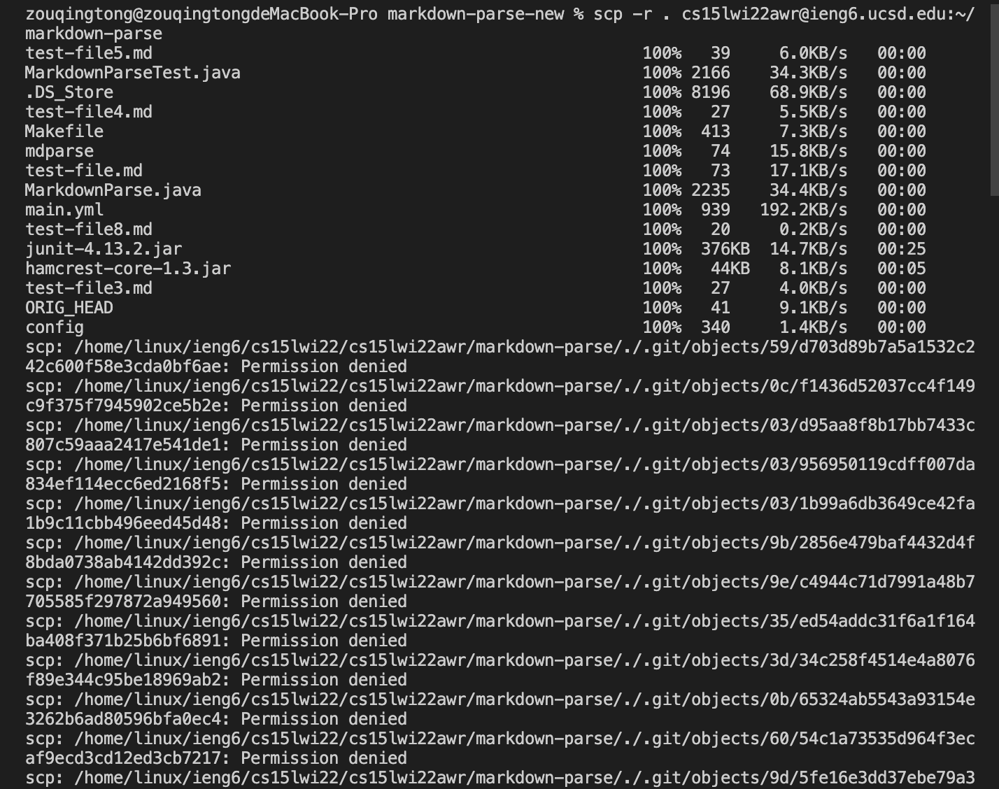
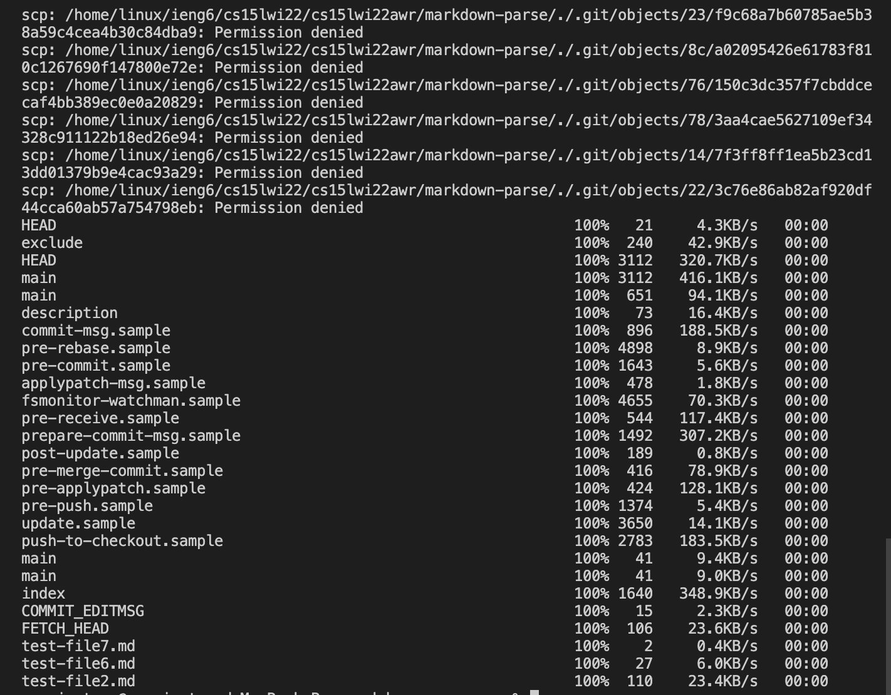
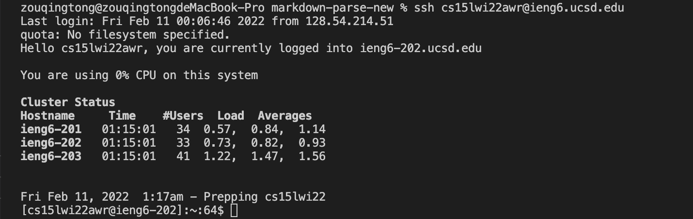
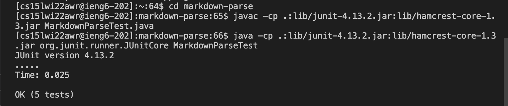
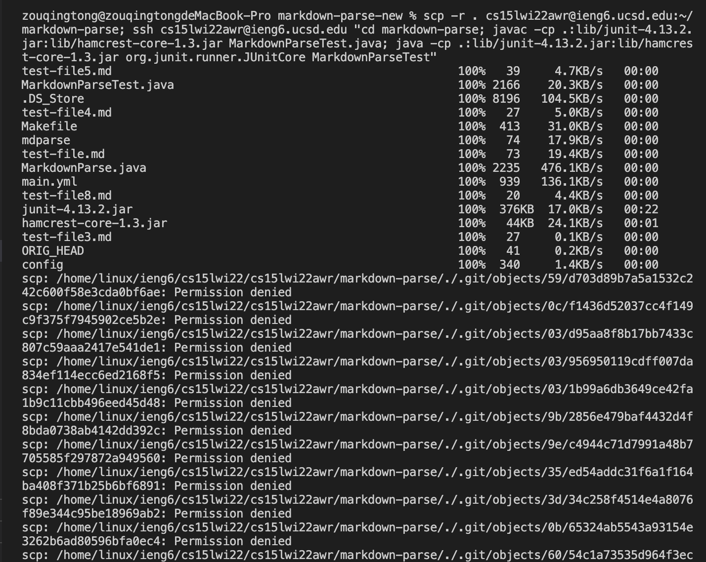
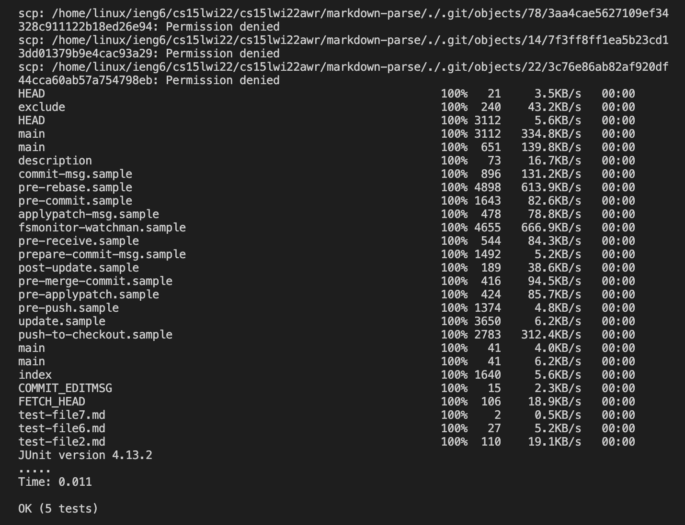

# Lab Report 3
# Copy whole directories with `scp -r`
## Step 1

* The code copies the whole markdown-parse directory to my ieng6 account.
* The `-r` option makes `scp` work recursively.
* The `.` is the source, and is the current directory.
* The `~/markdown-parse` creates a markdown-parse directory on the remote server and then `scp` copies the contents of this directory recursively there.
## Step 2

* The code helps me log into the server.

* The code helps me `cd` into the markdown-parse directory.
* It then compiles and runs MarkdownParseTest.java file on the server.
## Step 3

* The code combines several commands to copy the whole directory and run the tests on the server in one line.
* `scp -r` copies the whole directory to the server.
* `ssh` logs me into the server.
* `cd` gets me into the markdown-parse directory.
* `javac` and `java` compile and run the tests on the server.