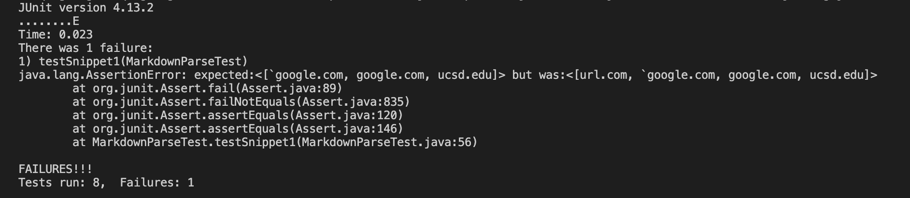
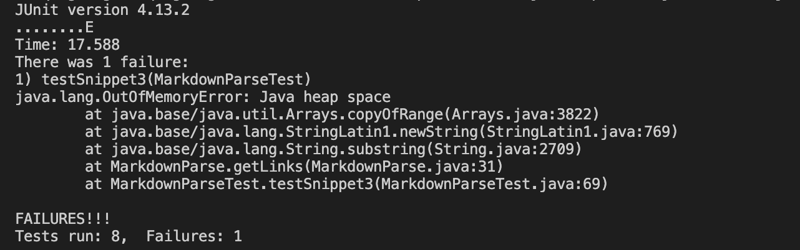

# Lab Report 3
* A [link](https://github.com/qzou1215/markdown-parse-new.git) to my markdown-parse repository
* A [link](https://github.com/aajc/markdown-parse.git) to the repository I reviewed
## Test for Snippet 1 (Implementation Reviewed)
* What markdown-parse should produce

* Test code

* Test output

## Test for Snippet 2 (Implementation Reviewed)
* What markdown-parse should produce

* Test code

* Test output

## Test for Snippet 3 (Implementation Reviewed)
* What markdown-parse should produce

* Test code

* Test output

## Test for Snippet 1 (My Implementation)
* What markdown-parse should produce

* Test code

* Test output

## Test for Snippet 2 (My Implementation)
* What markdown-parse should produce

* Test code

* Test output

## Test for Snippet 3 (My Implementation)
* What markdown-parse should produce

* Test code

* Test output

## Answers to questions
* I think there is a small code change that will make my program work for snippet 1 and all related cases that use inline code with backticks.
I can write a helper method that determines a valid link. In this case, if open bracket or open parenthesis occur between a pair of backticks, the method will determine this is an invalid link, so markdown-parse will not return the link.
* I think there is a small code change that will make my program work for snippet 2 and all related cases that nest parentheses, brackets, and escaped brackets.
I can change the code of markdown-parse to make `closeParen` the index of the last close parenthesis, so markdown-parse will return the entire link in the parathesis. In this case, the program will reutrn `a.com(())` rather than `a.com((`.
* I think there is a small code change that will make my program work for snippet 3 and all related cases that have newlines in brackets and parentheses.
I can write a helper method that returns a new string with the same content as Snippet 3, but it makes each link in the same line, so the output will not include new lines. For the link without close parenthesis, I can write a helper method that decides if a link has close parenthesis. If it doesn't, the program will consider it as an invalid link and will not return it.

