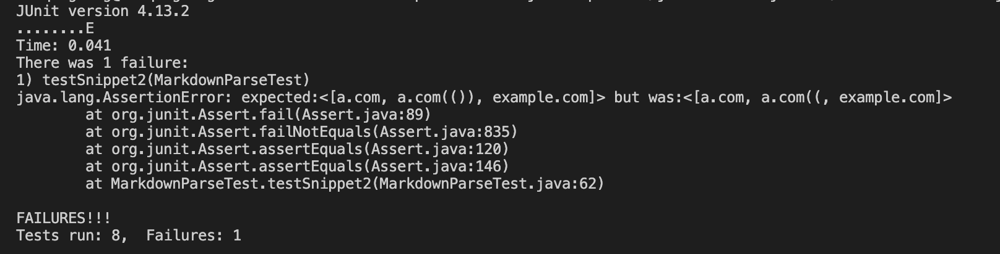

# Lab Report 3
* A [link](https://github.com/qzou1215/markdown-parse-new.git) to my markdown-parse repository
* A [link](https://github.com/aajc/markdown-parse.git) to the repository I reviewed
## Test for Snippet 1 (Implementation Reviewed)
* What markdown-parse should produce

* Test code

* Test output

## Test for Snippet 2 (Implementation Reviewed)
* What markdown-parse should produce

* Test code

* Test output

## Test for Snippet 3 (Implementation Reviewed)
* What markdown-parse should produce

* Test code

* Test output

